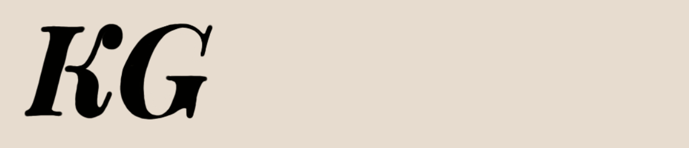

<link rel="stylesheet" href="style.css" />
<!--
**kgolder92/kgolder92** is a ✨ _special_ ✨ repository because its `README.md` (this file) appears on your GitHub profile.
-->

<!-- # Hi there, I'm Kayla 👋 -->


<!---->


 🔭 &nbsp; I’m currently working on TabKeeper - one tab to rule them all to help increase browser/computer speed, general organization and development eficiency
<!--- 🌱 I’m currently learning ... -->
 📫 &nbsp; How to reach me: &nbsp; <a href="https://www.linkedin.com/in/kayla-golder-2060a5137/">  </a> &nbsp; <a href="https://twitter.com/GolderKayla">  </a> &nbsp; <a href="mailto: golderkayla@gmail.com">  </a>

<!-- ⚡  Fun fact: -->

```javascript
const Kayla = {
   pronouns: 'she | her',
   code: 'JavaScript, HTML5, CSS3',
   technologies: ['React', 'Node', 'Express', 'MongoDB', 'PostgreSQL', 'Docker', 'AWS'],
   techCommunities: {
     speaker: 'CUNY Tech',
     participant: ['Women Who Code NYC', 'Whiteboard Masters'],
   },
   hobbies: ['snowboarding, 'skateboarding', 'coding', 'reading', 'drinking coffee', 'hiking', 'rock climbing', 'hammocking', '...and the list goes on'],
   CurrentChallenge: 'Hacktoberfest!',
}
```


<!-- Resources -->
<!-- Icons: https://www.iconfinder.com -->
<!-- GitHub Stats: https://github.com/kgolder92/github-readme-stats -->

